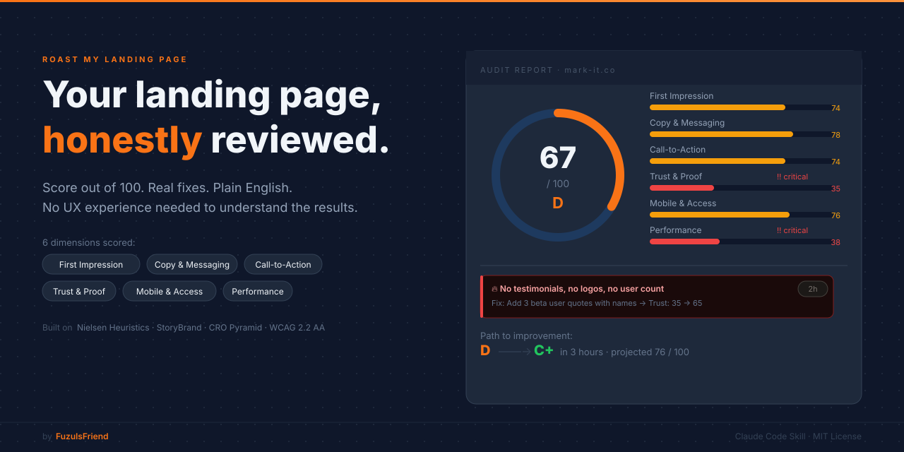

# Roast My Landing Page

[](LICENSE)
[](SKILL.md)

Give Claude a URL. Get a scored, plain-English report with specific fixes and time estimates.

---

## You don't need to know UX to get an expert audit

You give Claude the URL. Claude scores it across 6 dimensions using the same frameworks professional UX consultants use. The report tells you exactly what to fix, how long it will take, and why it matters. You do not need any background in UX, conversion rate optimization, or web design to act on the results.

---

## What it checks

| Dimension | Weight | What it means |
|-----------|--------|---------------|
| First Impression | 20% | Can a visitor understand what you do in 3 seconds? |
| Copy and Messaging | 20% | Is the writing clear, jargon-free, and benefit-focused? |
| Call-to-Action | 15% | Is the CTA visible, compelling, and the only clear next step? |
| Trust and Social Proof | 15% | Are there testimonials, logos, numbers, or guarantees? |
| Mobile and Accessibility | 15% | Does the page work on phones? Can everyone use it? |
| Performance and Technical | 15% | Does it load fast? Are the SEO basics covered? |

Every finding includes: what is wrong, why it matters, the specific fix, and a time estimate.

---

## Install

```bash
git clone https://github.com/FuzulsFriend/roast-my-landing-page ~/.claude/skills/roast-my-landing-page
```

**Recommended for visual analysis:**

- [Playwright CLI](https://github.com/lackeyjb/playwright-skill) - takes screenshots at multiple viewports
- [Chrome DevTools MCP](https://github.com/modelcontextprotocol/servers) - runs Lighthouse and captures console errors

---

## Usage

```
Roast my landing page: https://yoursite.com
```

```
Audit my website and tell me the top 3 things killing conversions
```

```
What's wrong with my homepage?
```

---

## What you get

```
LANDING PAGE ROAST: yoursite.com
━━━━━━━━━━━━━━━━━━━━━━━━━━━━━━━
Overall Score: 67/100 (D)
Business: SaaS | Goal: Free trial signup

BREAKDOWN:
  First Impression:  [████████░░]  78/100
  Copy and Messaging:[██████████]  82/100
  Call-to-Action:    [████████░░]  74/100
  Trust and Proof:   [████░░░░░░]  35/100  !!
  Mobile and Access: [████████░░]  76/100
  Performance:       [████░░░░░░]  38/100  !!

TOP 3 ROASTS:
1. "No testimonials anywhere on the page..."
2. "Your page took 6 seconds to load..."
3. "The signup button says 'Get Started' but..."
```

Plus a visual browser report with an animated score gauge, color-coded dimension bars, collapsible findings per section, and a step-by-step improvement timeline.

---

## Built on proven UX and conversion frameworks

This skill does not score based on opinions. Every dimension maps to a published, peer-reviewed, or industry-standard framework.

**[Nielsen's 10 Usability Heuristics](https://www.nngroup.com/articles/ten-usability-heuristics/)** - Jakob Nielsen, Nielsen Norman Group, 1994. The most cited usability framework in existence, used by every major UX team in the world. It gives the audit a principled checklist for identifying confusion, inconsistency, and friction before a user ever bounces.

**[StoryBrand Framework](https://buildingastorybrand.com/)** - Donald Miller, 2017. Clarifies messaging by placing the customer as the hero of the story. It explains why most landing pages confuse visitors instead of converting them, and gives Claude a structured way to diagnose that confusion.

**[CRO Pyramid / LIFT Model](https://www.widerfunnel.com/conversion-rate-optimization/)** - WiderFunnel. Breaks conversion down into 6 factors: Value Proposition, Relevance, Clarity, Anxiety, Distraction, and Urgency. Informed by thousands of A/B tests across real campaigns, it keeps the scoring grounded in what actually moves the needle.

**[WCAG 2.2 AA](https://www.w3.org/TR/WCAG22/)** - W3C Web Accessibility Guidelines. The international standard for web accessibility. Ensures your page works for people with disabilities, and keeps you on the right side of accessibility law.

**[Core Web Vitals](https://web.dev/vitals/)** - Google. Google's official performance metrics: Largest Contentful Paint, Interaction to Next Paint, and Cumulative Layout Shift. Slow pages rank lower in search results and convert worse.

**[Baymard Institute Research](https://baymard.com/)** - 130,000+ hours of UX research on real users. Informed the trust signal and CTA scoring criteria with data from studies on how real people read, click, and abandon pages.

---

## Industry-aware scoring

Different business types have different success criteria. Scoring adjusts for SaaS, ecommerce, course, agency, newsletter, and early-stage or pre-launch products. A page with zero testimonials scores differently for a day-1 launch than for a product that has been live for 6 months.

---

## What's included

```
roast-my-landing-page/
├── SKILL.md                           # Main skill instructions
├── assets/
│   ├── banner.svg                     # Repository banner
│   ├── preview.png                    # Example report screenshot
│   ├── report-template.md             # Text report template
│   └── report-ui.html                 # Visual browser report (fire theme)
└── references/
    ├── scoring-rubric.md              # Exact checkpoints per dimension
    ├── nielsen-heuristics.md          # 10 heuristics adapted for landing pages
    ├── storybrand-framework.md        # StoryBrand audit format
    ├── cro-checklist.md               # CRO Pyramid and CTA rules
    ├── copy-analysis-rules.md         # Headline, body copy, jargon detection
    ├── wcag-essentials.md             # 8 WCAG rules in plain English
    ├── anti-patterns.md               # 17 always-wrong patterns
    ├── industry-benchmarks.md         # Weight adjustments per business type
    └── examples/
        ├── score-90-plus.md           # What an A-plus page looks like
        └── common-fails.md            # Top 10 most common issues
```

---

## Works best with

- **[Playwright CLI](https://github.com/lackeyjb/playwright-skill)** - screenshots at 3 viewports plus an E2E smoke test
- **[Chrome DevTools MCP](https://github.com/modelcontextprotocol/servers)** - Lighthouse metrics and console errors
- **Agent Teams mode** - all 6 dimensions analyzed in parallel for faster results (`export CLAUDE_CODE_EXPERIMENTAL_AGENT_TEAMS=1`)

---

## License

MIT

---

*Made by [Tomer E (FuzulsFriend)](https://github.com/FuzulsFriend)*
